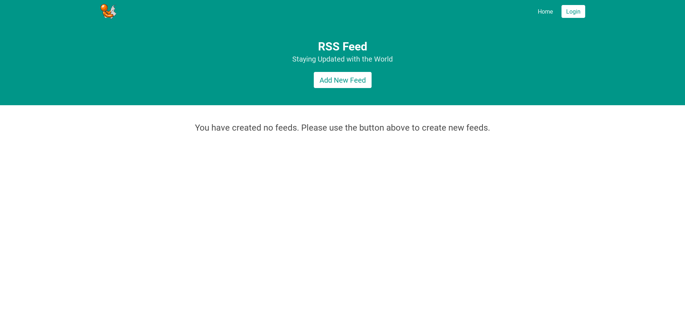
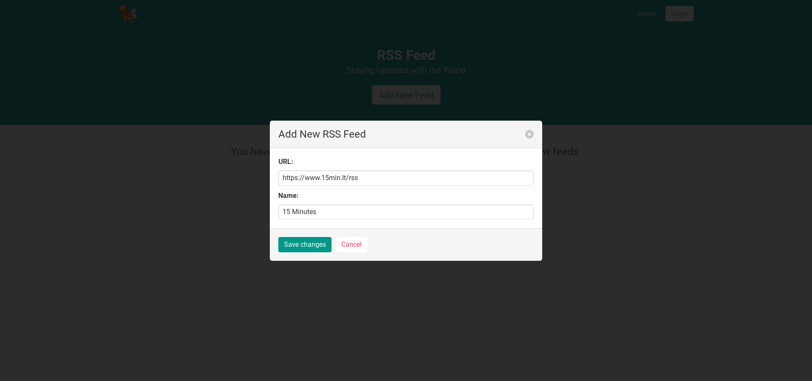
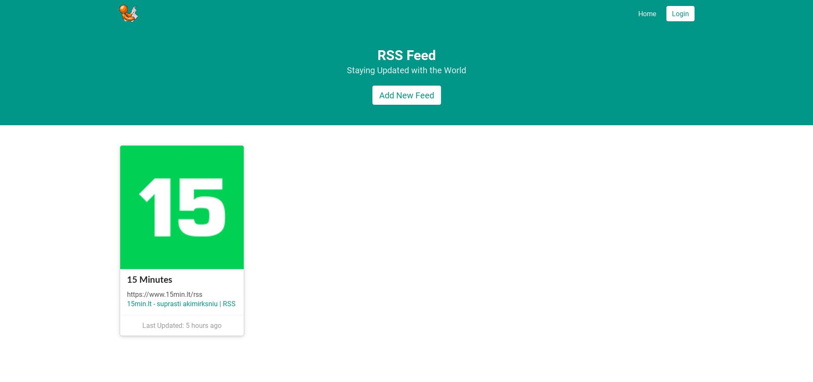
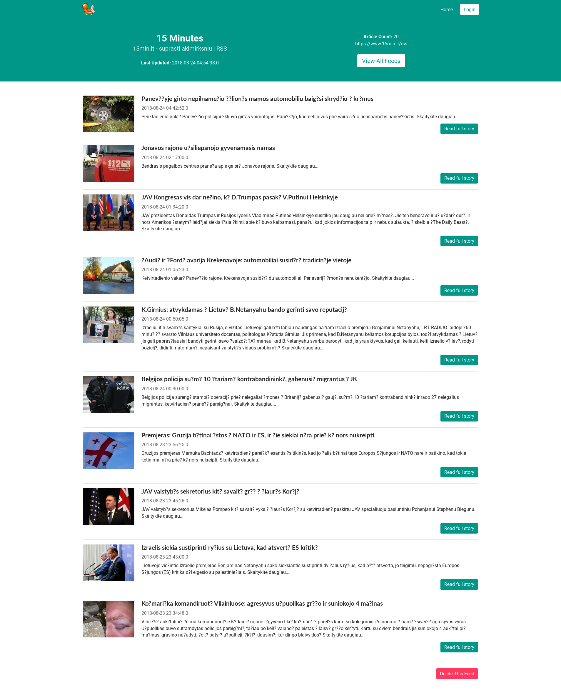

## Softneta Test Application

Softneta is a simple demo _XML RSS Feed_.

Please see **Architecture Section** for important information about the project.

### Features

1. Beautiful and Responsive user-interface
2. Generating RSS Feed from given URL
3. Front-End and Back-End User Data Validation
4. Deleting feeds
5. Adding new feeds
6. Background service to periodically update feed
7. Good error handling
8. Async services for speed
9. Pretty Formatted time
10. Feeds sorted according to last upadted (descending)
11. Feed Items sorted according to last published
12. Nice image display








### Architecture

This application is built with [Spring Boot](https://spring.io). Spring Boot makes it easy to create stand-alone, production-grade Spring based Applications that you can "just run".

To get a general overview of the Spring Boot architecture, please read more from the [Spring Boot Guides](https://spring.io/projects/spring-boot).


This project uses the MVCS architecture.

1. Models (Data Access Objects) - (src/main/java/com/clintonyeb/SoftnetaDev/models)
2. View Layer (JSP)- (src/main/webapp/WEB-INF/views)
3. Controller (Coordinator for Views and Models) - (src/main/java/com/clintonyeb/SoftnetaDev/controllers)
3. Service Layer (Services controllers) - (src/main/java/com/clintonyeb/SoftnetaDev/services)

The business logic of the application is contained in the **src** folder of the project folder. Inside the src folder (src/main/java/com/clintonyeb/SoftnetaDev/), there 6 folder and the entry point into the application (src/main/java/com/clintonyeb/SoftnetaDev/Application.java).

### NodeJS

There is also include a NodeJS packaging system in the project. This is only needed during development and is required to building the CSS file for the project view files.
Once the CSS file is built, it is only required to be rebuilt after changes are made to it.

### Important

The Project contains a scheduled service in (src/main/java/com/clintonyeb/SoftnetaDev/services/ScheduledService.java). This service handles waking up an repeated intervals to update feeds in the system.

### How it Works

User are able to add new XML RSS Feeds through a dialog.
The webserver then fetches all related feeds items for that feed.
The webserver also executes a background service that updates all feed items.


### Requirements to run Application

1. Java 8
2. MySQL

The application was tested using Linux - Debian 9.1, MYSQL version 15.1 and OpendJDK version 1.8.0_171.
It is nevertheless expected to work on major platforms.

### Installation

#### Database Configuration

You need to configure a MYSQL instance to be able to run the application. The application uses an in-mmenory database(h2) for testing, but requires a real database to run.

After you have installed a MYSQL instance:
Login and create a username and password for the application to use.

```sql
    GRANT ALL PRIVILEGES ON *.* TO 'softneta'@'localhost' IDENTIFIED BY 'softnetapassword';
```

This create the default `username` and a `password` that the application is already configured with.
If you wish to change the provided username and password, then you will have to change the configurations in (src/main/resources/application.properties).

Finally, create the database that the application requires:
```sql
CREATE DATABASE feeds;
```


#### Running the Application

Download and Build project:

```
git clone https://github.com/clintonyeb/softnetadev.git
cd softnetadev
./mvnw package
java -jar target/softnetadev.jar
```

> You can then access softneta here: [localhost:8080](http://localhost:8080) to view application


1. Running as a Packaged Application

After MYSQL is setup, you can run the application from the included jar file.

>java -jar target/softnetadev-0.0.1.jar  

> Visit: `localhost:8080` to view application

Note that, the jar file will not work if you changed the MYSQL default username and password. You will need to manually build the jar file again.


2. Running from an IDE

For a more involved running, setup your MYSQL instance and provide the username and password in the application.properties configuration file.
You can then run your application using the main class (src/main/java/com/clintonyeb/SoftnetaDev/Application.java)

Open the application in your favorite IDE (Intellij Idea, Eclipse, Netbeans, Visual Studio).

Run from the IDE.

3. Or you can run it from Maven directly using the Spring Boot Maven plugin. If you do this it will pick up changes that you make in the project immediately (changes to Java source files require a compile as well - most people use an IDE for this):

./mvnw spring-boot:run

Packaging into a jar file

The application can be managed by maven. 
First install maven: [https://maven.apache.org/install.html]
And then from the root directory, run

> mvn clean install.

A jar file is generated and put into the target directory.


### Tests

The application is fully tested. (src/test)


### Possible Future Improvements

1. User management - Login and Registration
2. Web Sockets - for instant notifications on RSS Feeds
3. Adding more tests
4. Improving UI
5. Docker support for easy installation


### Known Issues

1. Bundled Tomcat Version might be different from system Tomcat version. Application will run as long as the API is compatible.